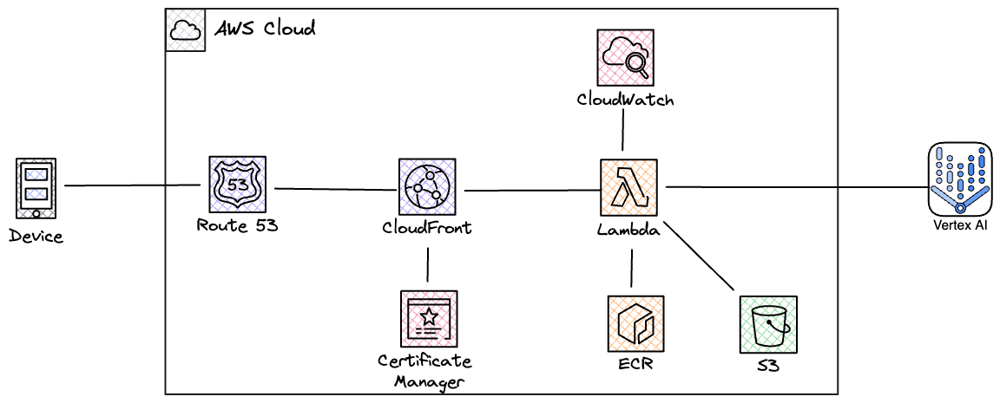

# Warike Assistant (Expo + AWS Lambda + S3 Vectors RAG)
Warike Assistant is a personal, RAG-powered chat application designed to help users find answers in **company documentation** via natural-language conversation.

In this repo, the initial “knowledge base” is the **Davis Instruments Vantage Pro2 Console User Manual**, stored as Markdown sources in:
- `data-ingestion/assets/install.ts` (installation / setup content)
- `data-ingestion/assets/usage.ts` (console usage / operations content)

The ingestion pipeline converts those manuals into embeddings and stores them in **AWS S3 Vectors** so the assistant can retrieve relevant passages and answer questions with grounded, manual-based responses. This makes it suitable as a customer-support tool for internal teams and (with the right content scope and permissions) for sharing with Davis Instruments distributors.

This repository contains a multi-package application composed of:
- `expo/`: Expo React Native client app (mobile + web via Expo Router).
- `lambda/`: AWS Lambda (container image) providing a streaming `/api/chat` endpoint backed by a Mastra agent + RAG tool.
- `data-ingestion/`: Node/TypeScript ingestion runner that chunks docs, generates embeddings, and upserts vectors into AWS S3 Vectors.
- `infra/`: Terraform infrastructure for ECR, Lambda (image), IAM, CloudFront, and related resources.

## Architecture diagram


## Repository layout
- `expo/`: client application
  - `expo/app/`: routes (Expo Router)
    - `expo/app/_layout.tsx`: root layout, Clerk auth provider, route gating
    - `expo/app/api/chat+api.ts`: local Expo API route (Gemini streaming; primarily useful for local/dev)
    - `expo/app/api/completion+api.ts`: local Expo API route (prompt completion streaming)
  - `expo/components/`: UI components
    - `expo/components/ChatPage.tsx`: chat page using `useChat` + streaming transport
    - `expo/components/chat/*`: chat message rendering and input controls
  - `expo/utils/`:
    - `expo/utils/api.ts`: builds the base API URL from `EXPO_PUBLIC_API_BASE_URL`
    - `expo/utils/Database.ts`: local SQLite persistence (used by `ChatPage.tsx`)

- `lambda/`: AWS Lambda backend (container image)
  - `lambda/src/index.ts`: Lambda handler (streaming response) and `/api/chat` routing
  - `lambda/src/auth.ts`: Clerk JWT verification (`@clerk/backend`)
  - `lambda/src/env.ts`: environment variable parsing/validation (zod + dotenv)
  - `lambda/src/mastra/`:
    - `app.ts`: Mastra instance wiring (agent + vector store + observability)
    - `agent.ts`: `basicAgent` configuration
    - `model.ts`: Google Generative AI model + embedding model selection
    - `prompt.ts`: strict RAG system prompt
    - `tool.ts`: vector query tool (`@mastra/rag`) configured for S3 Vectors
    - `vector.ts`: S3 Vectors store (`@mastra/s3vectors`) configuration
    - `observability.ts`: OTEL exporter to Langwatch
    - `index.ts`: `runAgent(...)` helper that streams output to Lambda response

- `data-ingestion/`: ingestion runner
  - `data-ingestion/src/index.ts`: runs ingestion and an example query
  - `data-ingestion/src/app.ts`: document chunking + embedding + upsert to S3 Vectors
  - `data-ingestion/src/env.ts`: environment variable parsing/validation (zod + dotenv)
  - `data-ingestion/src/mastra.ts`: Mastra wiring for ingestion/querying
  - `data-ingestion/src/vector.ts`: S3 Vectors store config

- `infra/`: Terraform deployment
  - `infra/provider.tf`: Terraform backend + AWS provider
  - `infra/ecr.tf`: ECR repo + lifecycle policy (+ local-exec to seed an image)
  - `infra/lambda-chat.tf`: image-based Lambda deployment with streaming invoke mode + Function URL
  - `infra/lambda-chat.iam.tf`: IAM role/policies (CloudWatch logs + S3 Vectors + Bedrock)
  - `infra/cloudfront.tf`: CloudFront distribution fronting the Lambda Function URL

## Core runtime architecture
### High-level flow (production)
1. The Expo client sends chat messages to the backend URL at `EXPO_PUBLIC_API_BASE_URL` (see `expo/utils/api.ts`).
2. Requests include a Clerk JWT (see `expo/app/_layout.tsx` for Clerk integration and `expo/components/ChatPage.tsx` for auth headers).
3. AWS Lambda receives requests at `/api/chat` (`lambda/src/index.ts`).
4. Lambda verifies access using Clerk (`lambda/src/auth.ts`).
5. Lambda runs the Mastra agent (`lambda/src/mastra/*`), which:
   - uses a strict system prompt enforcing RAG grounding (`lambda/src/mastra/prompt.ts`)
   - calls a vector query tool to retrieve context from AWS S3 Vectors (`lambda/src/mastra/tool.ts`)
6. Lambda streams tokens back to the client using Lambda response streaming (`invoke_mode = "RESPONSE_STREAM"`).

### Knowledge base ingestion flow
1. `data-ingestion/src/app.ts` builds documents (from local markdown assets) and chunks them.
2. It generates embeddings for each chunk.
3. It upserts vectors + metadata into an S3 Vectors index.
4. The runtime query tool (Lambda) searches the same S3 Vectors index to retrieve context at chat time.

## Components and responsibilities
### Expo client (`expo/`)
- **UI + navigation**: Expo Router for file-based routing.
- **Auth**: Clerk (`@clerk/clerk-expo`), with token caching via `expo-secure-store`.
- **Chat**: `useChat` from `@ai-sdk/react` with `DefaultChatTransport` for streaming.
- **Persistence**: local SQLite via `expo-sqlite`.

Key files:
- `expo/app/_layout.tsx`: root provider setup and route guarding.
- `expo/components/ChatPage.tsx`: chat UI, streaming transport, and DB persistence.
- `expo/utils/api.ts`: API base URL builder.

### Lambda backend (`lambda/`)
- **HTTP entrypoint**: `lambda/src/index.ts`.
  - Validates auth.
  - Routes only `/api/chat`.
  - Parses request body `{ messages }`.
  - Streams agent output back.
- **Auth**: `lambda/src/auth.ts` verifies Clerk token.
- **Agent runtime**: Mastra agent (`lambda/src/mastra/*`).
- **RAG retrieval**: vector query tool configured for S3 Vectors.
- **Observability**: OTEL exporter configured for Langwatch.

### Data ingestion (`data-ingestion/`)
- **Ingest**: `data-ingestion/src/app.ts`.
  - Create documents.
  - Chunk documents.
  - Embed text.
  - Upsert vectors + metadata into S3 Vectors.
- **Observability**: OTEL exporter configured for Langwatch.

### Terraform infrastructure (`infra/`)
- **ECR**: container registry for Lambda images.
- **Lambda**: image-based deployment, response streaming enabled, Function URL created.
- **IAM**: permissions for logging + vector operations (and Bedrock invoke permissions).
- **CloudFront**: optional edge distribution in front of the Lambda Function URL.

## API surface
### Lambda: `/api/chat`
- **Path**: `/api/chat`
- **Method**: `POST`
- **Auth**: Clerk JWT in either:
  - `Authorization: Bearer <token>` or
  - `X-Clerk-Token: <token>`
- **Body**: JSON `{ "messages": [...] }`
  - Message format is the UI message format used by the `ai`/`@ai-sdk/react` stack.
- **Response**: streaming (token stream) from the agent.

Notes:
- The Lambda handler currently rejects non-matching paths with `404 Not Found`.

## Configuration
### Expo environment variables
Set via `.env` / EAS / CI:
- `EXPO_PUBLIC_API_BASE_URL`: Base URL where `/api/chat` is hosted (e.g., CloudFront domain).
- `EXPO_PUBLIC_CLERK_PUBLISHABLE_KEY`: Clerk publishable key.

### Lambda environment variables
Validated in `lambda/src/env.ts`:
- `NODE_ENV`: `development` | `test` | `production`
- `AWS_REGION`
- `GOOGLE_GENERATIVE_AI_API_KEY`
- `GOOGLE_LANGUAGE_MODEL` (default `gemini-2.5-flash`)
- `GOOGLE_EMBEDDING_MODEL` (default `text-embedding-004`)
- `AWS_S3_VECTORS_BUCKET_NAME`
- `AWS_S3_VECTORS_INDEX_NAME`
- `LANGWATCH_API_KEY`
- `CLERK_SECRET_KEY`

### Data ingestion environment variables
Validated in `data-ingestion/src/env.ts`:
- `NODE_ENV`
- `AWS_REGION`
- `AWS_PROFILE`
- `AWS_S3_VECTORS_BUCKET_NAME`
- `AWS_S3_VECTORS_INDEX_NAME`
- `GOOGLE_GENERATIVE_AI_API_KEY`
- `LANGWATCH_API_KEY`

### Terraform variables
See `infra/README.md` for the expected `terraform.tfvars`-style values (project name, region/profile, model keys, vector index/bucket, Clerk secret, Langwatch key, and domain settings).

## Local development
### Prerequisites
- Node.js (Expo + Lambda + ingestion are Node/TypeScript)
- pnpm (the packages use `pnpm-lock.yaml`)
- AWS CLI (for S3 Vectors and deployment)
- Docker (for building/pushing the Lambda image)
- GNU Make (to use the repo `Makefile` targets)

### Makefile (recommended)
This repo includes a root `Makefile` to coordinate setup and common workflows.

Show available commands:
```bash
make help
```

### Expo
```bash
cd expo
pnpm install
pnpm start
```

The app expects `EXPO_PUBLIC_API_BASE_URL` to be set so it can call `/api/chat`.

### Lambda (local)
The Lambda package is TypeScript and compiles to `dist/`.

```bash
cd lambda
pnpm install
pnpm build
pnpm start
```

Note: running the Lambda container locally vs. running `node dist/index.js` are different modes; the deployed runtime uses the AWS Lambda container entrypoint (`CMD ["index.handler"]` in `lambda/Dockerfile`).

### Data ingestion
```bash
make ingest
```

(Equivalent to running `pnpm start` inside `data-ingestion/`.)

## S3 Vectors setup
Create/reuse the S3 Vectors bucket + index:

```bash
make setup-vectors
```

You can override defaults via environment variables:
```bash
AWS_PROFILE=default AWS_REGION=us-east-1 VECTOR_BUCKET_NAME=bucket-vector-s3-lambda INDEX_NAME=documents make setup-vectors
```

To delete the index + bucket:
```bash
make cleanup-vectors
```

## Deployment
### Terraform
```bash
make infra-init
make infra-plan
make infra-apply
```

This creates:
- ECR repository
- Lambda (image-based) with Function URL and response streaming
- CloudFront distribution (if configured)

### Build and push the Lambda image
Build, push, update `infra/lambda-chat.tf` to the new tag, and (optionally) deploy via Terraform apply:

```bash
make push-image
```

Notes:
- By default it prompts before `terraform apply`.
- To push + update the TF file but skip apply:

```bash
NO_TERRAFORM_APPLY=1 make push-image
```

## Runtime behavior notes
- Lambda uses response streaming (`awslambda.streamifyResponse(...)`).
- Auth failures return `Unauthorized`.
- Non-`/api/chat` paths return `404 Not Found`.
- The agent uses a strict RAG prompt that constrains answers to retrieved context.

## Scripts
- `setup.sh`: create/reuse S3 Vectors bucket + index
- `cleanup_vector_store.sh`: delete S3 Vectors index + bucket
- `setup_vector_store.sh`: deprecated wrapper (calls `setup.sh`)
- `run_data_ingestion.sh`: run `data-ingestion` pipeline (`pnpm start`)
- `push_chat_image.sh`: build/push Lambda image to ECR, update Terraform tag, and (optionally) deploy
- `test_stream.sh`: test streaming chat endpoint using Terraform outputs (`app_domain_name` -> CloudFront -> Lambda URL)

## Makefile
Common targets:
- `make setup-vectors`
- `make ingest`
- `make infra-apply`
- `make push-image`
- `make test-stream`

Run `make help` for the full list.
